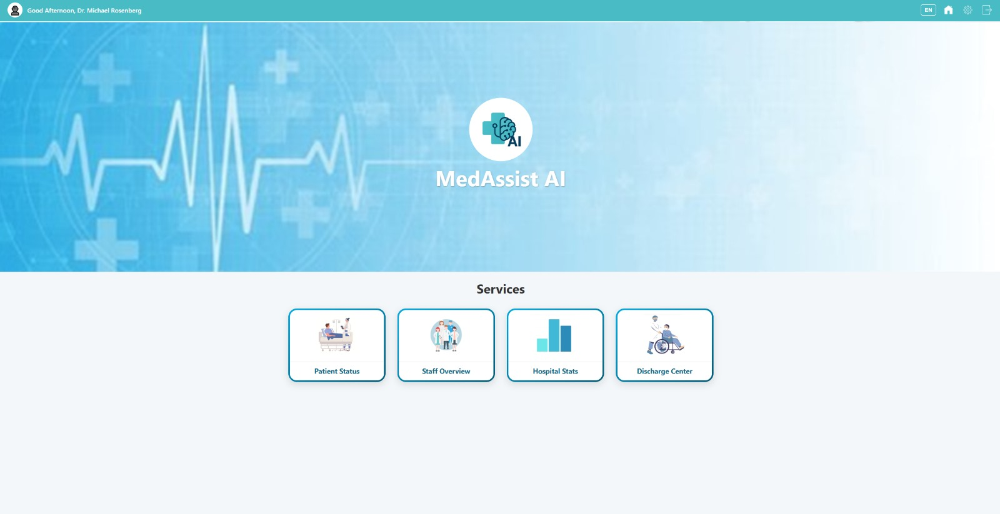
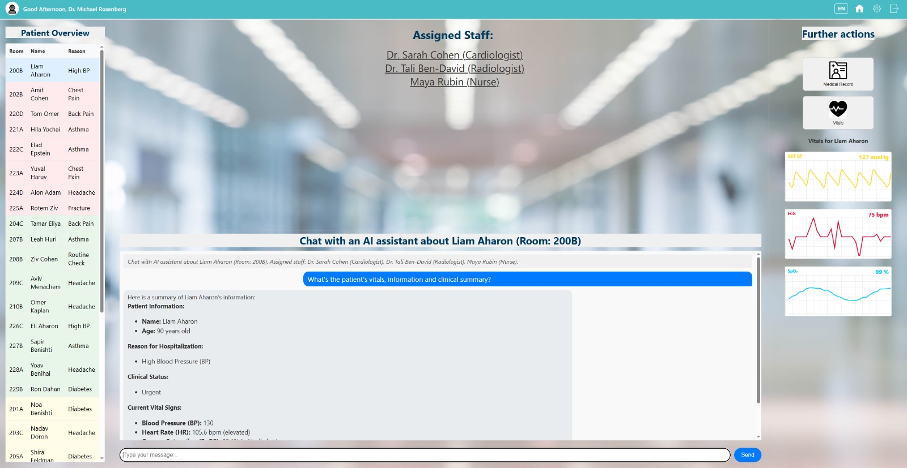

# MedAssist AI 

> AI-driven hospital assistant: anticipate clinical needs, optimize workflows, and deliver real-time patient insights across the care continuum.

> Harnessing continuous data streams and predictive modeling, MedAssist AI transforms hospital operations—from live patient monitoring to discharge planning—into seamless, patient-centered workflows, ensuring no detail is missed and every decision is powered by actionable intelligence.

---

## 🔍 Overview

MedAssist AI is a comprehensive hospital assistant platform built in 24 hours at HUJI Hackathon 2025, combining a Python FastAPI backend, a React dashboard, and Google’s Gemini AI:

- **Generates instant patient summaries**: combines historical records and live vitals into a unified, actionable snapshot.  
- **Forecasts discharge readiness**: predicts patient readiness hours in advance with adaptive, AI-driven risk scores.  
- **Flags critical condition changes**: monitors vitals and clinical data in real time, alerting care teams to emerging issues via rule-based logic and NLP.  
- **Identifies operational blockers**: detects bottlenecks—from lab delays to consult backlogs and transport issues—and suggests targeted resolutions.  
- **Suggests data-driven treatment paths**: leverages predictive models to recommend next steps tailored to each patient’s profile.  
- **Optimizes resource allocation**: automates routing of nursing alerts, PT orders, and social work referrals to the right team members.  
- **Enhances communication**: interactive AI assistant supports on-demand dialogues for patient summaries, vital-trend analysis, and care guidance.  
- **Seamless EMR integration**: plugs into existing hospital systems with minimal configuration, extending workflows without disruption.  

---

## 🌟 Key Features

| Feature                          | Benefit                                                                                                           |
| -------------------------------- | ----------------------------------------------------------------------------------------------------------------- |
| 🚑 **Live Bed Status Dashboard** | Real-time EMR sync showing current occupancy, predicted discharges, and LOS trends for proactive capacity management |
| 🔢 **Discharge-Readiness Score** | AI-driven risk score calibrated to hospital-specific metrics forecasts when patients are ready to go, reducing bottlenecks |
| 🛑 **Blocker Detection**         | Hybrid rule-based and NLP analysis uncovers pending orders, lab delays, consult backlogs, and transport issues instantly |
| 📤 **Smart Task Routing**        | Automatically assigns and notifies nurses, PTs, social workers, and other roles to resolve each blocker seamlessly |
| 💬 **Interactive AI Assistant**  | Chat interface powered by Gemini for instant access to patient summaries, vital-trend analysis, and personalized care recommendations |
| 🔒 **Privacy by Design**         | On-premise PHI de-identification with zero outbound identifiers ensures compliance and data security                 |
| 🔌 **Modular Integrations**      | Easily swap ML models, customize workflows, or connect new EMR systems via plugin-friendly architecture             |
| 📈 **Operational Insights**      | Dashboard analytics surface KPIs—bed turnover, average LOS, and resource utilization—for continuous performance improvement |

---

## 📐 Architecture

| Layer             | Technologies & Responsibilities                                                                 |
| ----------------- | ------------------------------------------------------------------------------------------------ |
| **Backend API**   | Python 3.12, FastAPI, Pydantic v2, Uvicorn; REST endpoints (`/hospital`, `/patients`, `/chat`)    |
| **Business Logic**| Domain-driven OO entities (`Patient`, `Ward`, `VitalSign`) enforcing validation and workflows     |
| **Data Layer**    | In-memory JSON store (auto-persist on shutdown) and SQLite demo DB; interchangeable via adapters  |
| **Frontend**      | React, TypeScript, Tailwind CSS; reusable components (`<PatientsTable>`, `<PatientMedicalSummary>`)|
| **AI / NLP**      | XGBoost discharge-risk model; Google Gemini for chat and note analysis; modular LLM adapters      |
| **Infra & CI/CD** | Docker Compose; GitHub Actions pipelines; Swagger & Redoc for API documentation                  |

**Extensible adapters** enable swapping ML models, LLM providers, or database backends without impacting core logic.

--- 

## 📸 Screenshots

<p align="center">
  <sub><strong>Landing Page</strong></sub><br>
  
</p>

<p align="center">
  <sub><strong>Doctor Dashboard</strong></sub><br>
  
</p>

<p align="center">
  <sub><strong>Login Screen</strong></sub><br>
  
</p>


## 🎥 Demo Video

<details>
  <summary>▶️ Watch the full demo</summary>

  <p align="center">
    <a href="https://youtu.be/jakP6N2kDo8" target="_blank">
      
    </a>
  </p>
</details>


---

## ⚙️ Tech Stack & Architecture

```plaintext
📦 HUJI-Hackathon-2025
├── .git/                          # Git version history
├── .idea/                         # IDE config files
├── LICENSE                        # MIT license
├── README.md                      # Project documentation
├── HospitalAssistant/             # Core backend (FastAPI + domain logic)
│   ├── api/                       # FastAPI routes
│   │   ├── __init__.py            # Package marker
│   │   └── app.py                 # Main application and router
│   ├── core/                      # Data layer & schemas
│   │   ├── __init__.py            # Package marker
│   │   ├── database.py            # SQLite/in-memory storage setup
│   │   └── schemas.py             # Pydantic models for requests/responses
│   ├── entities/                  # Domain models (OO logic)
│   │   ├── __init__.py            # Package marker
│   │   ├── Hospital.py
│   │   ├── MedicalRecord.py
│   │   ├── Patient.py
│   │   ├── SocialProfile.py
│   │   ├── VitalSign.py
│   │   └── Ward.py
│   ├── data/                      # Sample hospital datasets (JSON)
│   │   ├── demo_hospital.json
│   │   ├── demo_hospital_data.json
│   │   ├── hospital_15_patients.json
│   │   └── hospital_demo_balanced.json
│   ├── services/                  # External integrations & service controllers
│       ├── EMRConnector.py        # EMR data extraction
│       ├── ConversationService.py # Chat/interaction logic
│       ├── LLMService.py          # Gemini/LLM orchestration
│       ├── NotificationService.py # Teams/Slack routing
│       └── PredictiveModelController.py # ML inference handler   
└── docs/                          # Documentation assets
    ├── images/                    # Screenshots for README
    │   ├── landing.jpg
    │   ├── doctor_dashboard.jpg
    │   └── login.jpg
    └── demo/                      # Demo video/GIF
        └── medassist_demo.mp4

````

---

| Layer           | Technology & Role                                                    |
|-----------------|----------------------------------------------------------------------|
| **Backend API** | Python 3.12, FastAPI, Pydantic v2, Uvicorn                           |
| **Logic Layer** | OO Entities for domain rules; `Patient.discharge_ready()` & blockers  |
| **Data Layer**  | SQLite (demo) or in‑memory store; JSON seed files                    |
| **NLP/ML**      | XGBoost model + Gemini NLP for text summarization                   |
| **Infra**       | Docker Compose; GitHub Actions CI/CD                                 |

**Extensibility:** Modular adapters let you swap LLM providers (OpenAI, Cohere), upgrade to PostgreSQL or FHIR feeds, and containerize services independently.

</details>

---


## 🚀 Quick Start
```bash
# Clone repository
git clone https://github.com/Noamshabat1/HUJI-Hackathon-2025.git
cd HUJI-Hackathon-2025

# Start backend server
cd HospitalAssistant
uvicorn api.app:app --port 8003 --log-level debug

# Start frontend server
cd med_assist_website
npm install
npm start
````


---

## 👥 Team & Roles

| Name           | Role                |
| -------------- | ------------------- |
| Shay Morad | Team Lead & Backend     |
| Noam Shabat    | Backend & Full-Stack & DevOps & UX/UI | 
| Nitzan Ventura     |  Full-Stack & UX/UI    |
| Samuel Hayat  | Frontend    |

*Built in 24 h at ********HUJI Hackathon 2025******** (May 29–30, Jerusalem).*

---

## Acknowledgments

Special thanks to [Professor Michael Rosenberg, MD](https://med.umn.edu/bio/michael-rosenberg) for his expert guidance and support throughout this project.

---

## License

This project is licensed under the MIT License. See the [LICENSE](LICENSE) file for details.

---

